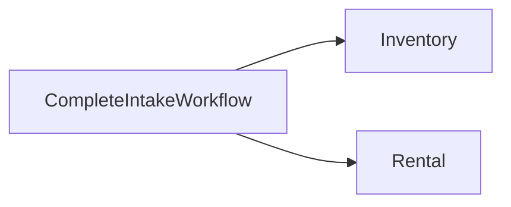

# Core Architecture

## Назначение документа

Документ описывает техническую архитектуру Core: стек технологий, структуру проекта, основные слои приложения и правила взаимодействия модулей.

Core должен быть простым для запуска, понятным для развития и готовым к будущим интеграциям.

---

## Основной стек

### Язык

- Python 3.13

### Управление проектом

- uv

### Backend

- FastAPI

### Database

- PostgreSQL

### ORM

- SQLAlchemy 2

### Database migrations

- Alembic

### Admin

- SQLAdmin

### Background jobs

- Redis
- RQ

### Images

- Pillow

### Barcode

- python-barcode
- qrcode

### PDF

- ReportLab

### Deployment

- Docker Compose

### Reverse proxy

- Angie

### Storage

- Local filesystem (MVP)

### Frontend

- SQLAdmin (MVP)
- React (Future)

---

## Главный принцип

Core является backend-first системой.

Core также является API-first системой: бизнес-возможность считается полноценной, когда она доступна через документированный API. Конкретный frontend является заменяемым клиентом API.

Сначала создается надежная серверная часть:

- база данных;
- бизнес-логика;
- API;
- админка;
- обработка фото;
- интеграции.

Красивый frontend можно добавить позже без изменения ядра.

---

## Высокоуровневая схема

```text
User / Phone / Browser
        |
        v
FastAPI Application
        |
        +-- Catalog
        +-- Inventory
        +-- Pricing
        +-- Media
        +-- Customers
        +-- Rental
        +-- Publishing
        +-- ImportExport
        +-- Users
        +-- Audit
        |
        v
PostgreSQL
        |
        +-- Local file storage
        +-- Redis / RQ
        |
        +-- AQSI
        +-- Tilda
        +-- Telegram
        +-- MAX
        +-- WB
        +-- Yandex Market
```

---

## Слои приложения

### API Layer

Отвечает за HTTP endpoints.

Пример:

```text
POST /api/products
GET /api/products
POST /api/intake/sessions
POST /api/publications/aqsi
```

API не должен содержать сложную бизнес-логику.

---

### Service Layer

Основная бизнес-логика.

Примеры:

- создать товар;
- создать вариант;
- принять товар на склад;
- сгенерировать SKU;
- загрузить фото;
- отправить товар в AQSI;
- создать договор аренды.

---

### Repository Layer

Работа с базой данных.

Сервисы не должны напрямую писать SQL вразнобой.

---

### Integration Layer

Работа с внешними системами.

Каждая интеграция должна быть изолирована:

```text
integrations/
├── aqsi/
├── tilda/
├── telegram/
├── max/
├── wb/
└── yamarket/
```

Core не должен зависеть от конкретной внешней платформы.

### Client Layer

Клиентами Core могут быть:

- SQLAdmin для технического администрирования;
- mobile-first интерфейс сотрудника;
- собственный React/Vue/Flutter frontend;
- интерфейс франшизы;
- Telegram, MAX или другой messenger-клиент;
- партнёрское приложение через публичный API.

Клиенты не должны дублировать бизнес-правила ядра.

---

## Структура проекта

```text
core/

├── docs/
│
├── src/
│   └── core/
│       │
│       ├── catalog/
│       ├── inventory/
│       ├── pricing/
│       ├── media/
│       ├── customers/
│       ├── rental/
│       ├── publishing/
│       ├── integrations/
│       ├── users/
│       ├── activity/
│       ├── audit/
│       ├── shared/
│       │
│       ├── config.py
│       ├── database.py
│       └── main.py
│
├── tests/
├── migrations/
├── storage/
├── docker/
│
├── pyproject.toml
├── uv.lock
├── docker-compose.yml
├── .env.example
└── README.md
```

---

## Модульная структура

Каждый бизнес-модуль внутри `src/core/` должен иметь похожую структуру:

```text
catalog/
├── models.py
├── schemas.py
├── service.py
├── repository.py
├── routes.py
└── admin.py
```

Где:

- `models.py` — SQLAlchemy модели;
- `schemas.py` — Pydantic схемы;
- `service.py` — бизнес-логика;
- `repository.py` — работа с БД;
- `routes.py` — HTTP endpoints;
- `admin.py` — SQLAdmin views.

---

## Catalog

Отвечает за:

- Product;
- Variant;
- Category;
- Brand;
- Attributes.

Правило:

```text
Product содержит название, категорию, основное описание и общее фото. Product не имеет SKU,
штрихкода, quantity, закупочной цены, цены продажи или rental commercial terms.

Variant существует всегда. Даже товар без видимых вариантов имеет один default Variant, который
клиентский UI может скрывать, пока он единственный. Variant имеет SKU, barcode, variant photo,
коммерческие условия и публикации. Quantity существует только для Variant в контексте Intake и
Inventory и изменяется через складской ledger.

Один barcode глобально и однозначно идентифицирует один Variant. Несколько кодов одного Variant
допустимы, но одинаковый manufacturer barcode у разных Variant, Product-level barcode и
ambiguous barcode lookup пока не поддерживаются.
```

Catalog управляет уже существующим каталогом: исправляет карточки, меняет коммерческие данные,
перепечатывает labels и повторяет публикации. Он не является обязательным вторым шагом Intake.

---

## Inventory

Отвечает за:

- склады;
- остатки;
- движения товара;
- приемку;
- списания;
- корректировки.

Правило:

```text
Любое изменение остатка проходит через StockMovement.
```

Источником истины является неизменяемый журнал `StockMovement`. Текущий остаток рассчитывается как сумма движений. Производный кэш или агрегированная таблица могут появиться позже только как оптимизация и не становятся источником истины.

---

## Pricing

Отвечает за цены.

Правило:

```text
Цена не хранится напрямую в Variant.
```

Один Variant может иметь несколько типов цен:

- purchase;
- retail;
- promo;
- rental_day;
- rental_week;
- aqsi;
- tilda;
- wb;
- yamarket.

---

## Media

Отвечает за:

- загрузку фото;
- хранение оригиналов;
- генерацию WebP;
- генерацию миниатюр;
- привязку фото к сущностям.

Правило:

```text
Фото обязательно для полноценной приемки товара.
```

Файл хранится в файловой системе, а в базе хранится путь и метаданные.

---

## Rental

Отвечает за:

- физические экземпляры оборудования;
- выдачу;
- возврат;
- осмотр;
- состояние;
- пломбы;
- обслуживание.

Правило:

```text
В аренду выдается RentalAsset, а не Product и не Variant.
```

Rental является первоклассным доменом. Он использует общую основу каталога, изображений, пользователей, аудита и физических идентификаторов, но имеет собственный повторяемый жизненный цикл выдачи, возврата, осмотра и обслуживания.

Customers и Rental являются разными bounded context. `Customer` — получатель имущества, а
`User` — сотрудник или пользователь Core. `Customer != User`.

```text
Product
    ↓
Variant
    ↓
InventoryItem
    ↓
RentalAsset
    ↑
RentalOrderItem
    ↓
RentalOrder
    ↓
Customer
```

Один `RentalAsset` представляет одну физическую вещь и не содержит `quantity`. Inventory
продолжает отвечать за количественный учет и immutable ledger на уровне `Variant`.

`RentalOrder` и `RentalAsset` имеют независимые state machine. Application workflow координирует
их изменения и владеет общей транзакцией.

### Customers

Customers владеет актуальной карточкой и контактами клиента. Rental хранит ссылку на клиента и
snapshot данных, необходимых для исторического представления заказа. Customers не управляет
заказами, экземплярами, платежами или пользовательскими аккаунтами.

### Intake и границы транзакции

Rental и Inventory не координируют друг друга напрямую.

Intake является application orchestration workflow и полным рабочим местом подготовки товара до
`ready-for-sale`. Одна пользовательская позиция Intake представляет Product и один или несколько
Variant, поступивших сейчас. Draft допускает добавление, удаление и редактирование вариантов.

Сохранённый Variant со штрихкодом должен иметь доступную barcode label до Complete Intake и
независимо от экрана, на котором Variant был создан. Генерация label зависит от сохранённой
identity Variant, а не от наличия StockMovement или завершённой Intake.

Для нового Variant Intake резервирует следующий номер общей Catalog sequence и сохраняет
`reserved_sku` вместе с соответствующим internal EAN-13. Резервация не создаёт Catalog Variant
или Inventory fact, не переиспользуется после удаления draft и атомарно переносится в настоящий
Variant при Complete. Поэтому label до Complete и Catalog после Complete печатают одну и ту же
физическую identity без временных браузерных кодов.

При завершении `CompleteIntakeWorkflow` координирует Catalog, Pricing, Receipt, Inventory и Rental
и является единственным владельцем общей SQL-транзакции. Проведение атомарно фиксирует складские
движения и исторические закупочные факты для каждого Variant; создание отдельных `RentalAsset`
выполняется в той же границе, когда это требуется сценарием.

Доменные сервисы и репозитории Rental и Inventory:

- не вызывают `commit()` или `rollback()` внутри caller-owned transaction;
- выполняют только относящиеся к своему контексту проверки и изменения;
- не импортируют workflow-классы.

Inventory не зависит от Rental. Межконтекстная координация находится в Application/Workflow
layer согласно ADR-002 и ADR-003.



После commit отдельная Intake-level операция оркестрирует публикацию всех Variant этой Intake,
которым нужна отправка в AQSI. Результат хранится и показывается отдельно по каждому Variant;
ошибки допускают безопасный retry и не переписывают проведённые Inventory или purchase facts.

### Печать товарных этикеток

`Labels` формирует векторные PDF с точным физическим размером 40 × 30 или 58 × 40 мм. Готовность
этикетки означает наличие сохранённой Variant identity и корректного internal EAN-13; она не
зависит от Inventory, фото, retail price, AQSI или Complete Intake. Печать является отдельным
side effect и никогда не входит в транзакцию проведения Intake.

Граница прямой печати:

```text
Intake / Catalog UI
    -> VariantLabelPrintService
    -> CupsPrintingAdapter (`lp` from cups-client)
    -> remote CUPS over IPP
    -> configured printer queue / OS driver
    -> Xprinter
```

`CupsPrintingAdapter` получает готовый одностраничный PDF и copies. API image содержит только
CUPS client, не cupsd и не printer driver. `PRINTING_ENABLED`, `CUPS_SERVER`, `CUPS_USER`,
`CUPS_PRINTER` и optional `CUPS_IPP_VERSION` задаются через environment; defaults не содержат
инфраструктурных адресов или пользователей. Для совместимости с macOS CUPS используется
`-h <server>/version=1.1 -U <user>`. Queue задаётся явно: printer discovery не является
capability check. Adapter запускает фиксированный `lp` безопасным argv без shell, ограничивает
copies 1..500, удаляет временный PDF и возвращает только `submitted`/external job id.
Текущий Docker → remote CUPS → macOS driver → USB Xprinter путь подтверждён; host Print Agent,
USB passthrough и privileged container не нужны. PDF/system print остаётся fallback.

Архитектурный acceptance criterion:

> Если после обычной приёмки оператор вынужден открыть Catalog, чтобы закончить подготовку товара
> к продаже, Intake workflow считается незавершённым.

Связь с будущим Sales пока не является действующей зависимостью. В Sprint 9 Rental может только
вывести экземпляр из прокатного фонда с назначением `SALE`; фактическая продажа будет
координироваться отдельным будущим workflow.

---

## Publishing

Отвечает за состояние публикации во внешние каналы.

Каналы:

- aqsi;
- tilda;
- telegram;
- max;
- wb;
- yamarket.

Правило:

```text
Внешние системы не являются источником истины.
```

---

## ImportExport

Отвечает за:

- импорт CSV из Tilda;
- будущий импорт Excel;
- экспорт данных;
- технические выгрузки.

Правило:

```text
Импортированные товары попадают в Core как draft и требуют проверки.
```

---

## Users

Отвечает за пользователей и роли.

Минимальные роли:

- administrator;
- manager;
- warehouse.

---

## Audit

Отвечает за историю важных действий.

Фиксируются:

- создание товара;
- изменение цены;
- изменение остатка;
- приемка;
- списание;
- публикация;
- аренда;
- возврат;
- изменение состояния оборудования.

---

## Очереди задач

Для долгих операций используется RQ + Redis.

В очередь отправляются:

- обработка изображений;
- генерация этикеток;
- публикация в мессенджеры;
- отправка товаров во внешние системы;
- импорт CSV.

---

## Хранение файлов

На MVP используется локальная файловая система.

Пример структуры:

```text
storage/
├── products/
│   └── SKU/
│       ├── original/
│       ├── web/
│       └── labels/
├── rental/
└── imports/
```

В будущем storage можно заменить на MinIO/S3 без изменения бизнес-логики.

---

## Mobile-first приемка

Первый пользовательский интерфейс, кроме SQLAdmin:

```text
/mobile/intake
```

Требования:

- работает с телефона;
- позволяет сделать фото камерой;
- позволяет выбрать фото из библиотеки;
- позволяет создать Product с одним или несколькими Variant;
- позволяет добавлять, удалять и редактировать Variant в draft;
- позволяет печатать label сохранённого Variant со штрихкодом до завершения;
- не дает завершить приемку без фото;
- атомарно фиксирует Inventory и закупочные факты при завершении;
- после завершения позволяет отправить нужные Variant Intake в AQSI со статусом и retry;
- не публикует товар автоматически.

Camera barcode scanning требует secure context: production deployment mobile UI должен быть
доступен по HTTPS. Ручной ввод и аппаратный scanner не зависят от Camera API и остаются fallback.

---

## SQLAdmin

SQLAdmin используется как техническая админка MVP.

Через нее можно:

- смотреть товары;
- редактировать справочники;
- проверять импорт;
- просматривать движения;
- смотреть публикации;
- управлять пользователями.

SQLAdmin не является финальным пользовательским интерфейсом.

---

## Будущий React frontend

React можно добавить позже.

Он будет использовать тот же FastAPI backend.

Планируемые экраны:

- приемка товара;
- карточка товара;
- склад;
- аренда;
- публикации;
- импорт;
- отчеты.

---

## Docker Compose

MVP должен запускаться одной командой:

```bash
docker compose up
```

Сервисы:

```text
backend
postgres
redis
worker
reverse-proxy
```

## Deployment and bootstrap

Основной способ развёртывания должен быть один, документированный и воспроизводимый. Цель — получить работающий экземпляр Core на подготовленном сервере не более чем за десять минут.

Bootstrap не должен требовать ручного SQL. Подробные цели описаны в [docs/11_deployment_bootstrap.md](11_deployment_bootstrap.md).

## Product documentation

README является точкой входа, но не заменяет пользовательскую, административную, API-, deployment-, franchise- и investor-документацию. Структура описана в [docs/12_product_documentation.md](12_product_documentation.md).

---

## Правила архитектуры

### 1. Product не знает о внешних системах

Плохо:

```
product.publish_to_tilda()"
```

Хорошо:

```
tilda_publisher.publish(variant)"
```

---

### 2. Остатки меняются только через движения

Нельзя напрямую менять количество без StockMovement.

---

### 3. Фото обязательно

Товар или Variant нельзя перевести в статус ready без фото.

---

### 4. Интеграции изолированы

Поломка Tilda Sync не должна ломать Catalog, Inventory или Rental.

---

### 5. Сначала backend, потом frontend

Core должен быть полезен даже без красивого интерфейса.

### 6. Intake завершается ready-for-sale, а не переходом в Catalog

Intake координирует создание Product и Variant, маркировку, проведение Inventory и последующую
публикацию в AQSI. Catalog остаётся самостоятельным интерфейсом управления существующими
карточками и не компенсирует незавершённость Intake.

---

## Что не делаем в MVP

- полноценную ERP;
- бухгалтерию;
- сложную CRM;
- маркетплейс-автоматизацию WB/Яндекс;
- собственный интернет-магазин вместо Tilda;
- сложную систему прав доступа;
- микросервисы;
- Kubernetes.

---

## Следующий шаг

После этого документа создается `05_er_diagram.md`.

ER-диаграмма должна описать только основные связи MVP:

- Product → Variant;
- Variant → Price;
- Variant → Stock;
- Variant → StockMovement;
- Variant → RentalAsset;
- RentalAsset → будущие Rental operations;
- Image → ImageLink;
- Variant → Publication.
