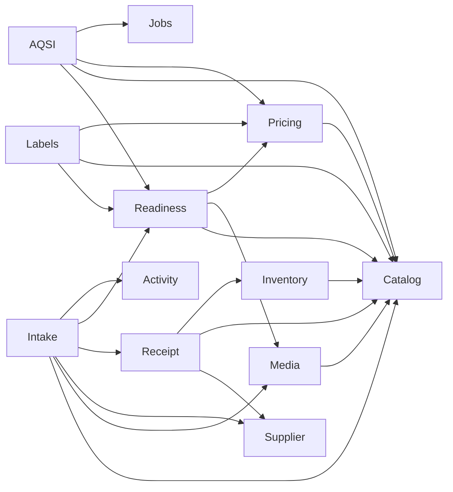

# Architecture Review v1 — Module Map

## Scope

This map describes the current monolith in `src/core` as of Sprint 8. A module is a
Python package with a coherent responsibility; it is not automatically a separately
deployable service. “Public API” includes HTTP endpoints and worker/CLI entry points.

## Module map

| Module / context | Responsibility | Public API | Internal services and components | Direct dependencies | Used by |
| --- | --- | --- | --- | --- | --- |
| `identity` | Local users, authentication, administrator and emergency-superuser lifecycle | `POST /api/auth/login`, `GET /api/auth/me`; identity CLI | `IdentityService`, auth dependencies, password/JWT helpers, user repositories | `shared`, database/config | Every protected HTTP module; CLI; audit attribution FKs |
| `catalog` | Categories, Product families, sellable Variants, stable SKU and internal EAN-13 barcode | CRUD under `/api/catalog/categories`, `/products`, `/variants`; barcode lookup | `CategoryService`, `CatalogProductService`, `CatalogVariantService`, SKU/barcode generators | `identity` only at delivery adapter, `shared` | Media links, Intake, Receipt, Inventory, Pricing, Readiness, Labels, AQSI |
| `media` | Immutable source-image metadata, local file storage, image-to-catalog links | `/api/media/images`, `/upload`, `/api/media/image-links` | `ImageService`, `ImageLinkService`, `ImageInspector`, `LocalImageStorage` | `catalog`, config, identity adapter, `shared` | Intake, Readiness; future Rental |
| `supplier` | Reusable purchasing counterparties with stable internal codes | CRUD under `/api/purchasing/suppliers` | `SupplierService`, code generator, repository | identity adapter, `shared` | Receipt, Intake |
| `receipt` | Supplier Receipt aggregate, draft lines, posting and cancellation lifecycle | CRUD `/api/receipts`; item routes; `/post`; `/cancel` | `ReceiptService`, `ReceiptItemService`, `ReceiptPostingService`, `ReceiptCancellationService`, number generator | `supplier`, `catalog`, `inventory`, identity adapter, `shared` | Intake completion; direct staff/admin API |
| `inventory` | Append-only stock ledger and SQL-derived balances | No direct HTTP API yet | `InventoryService`, `StockMovementRepository` | `catalog`, `shared` | Receipt posting/cancellation; tests; future sales/rental/inventory workflows |
| `pricing` | Append-only effective retail/promo price history | Set/current/history under `/api/pricing/variants/{id}/prices` | `PriceService`, `PriceRepository`, money helpers | `catalog`, identity adapter, `shared` | Readiness, Labels, AQSI |
| `readiness` | Derived Ready for Sale policy and employee attention projection; no persisted readiness status | `GET /api/readiness/variants/{id}/ready-for-sale`; `GET /api/readiness/attention` | shared readiness policy, `ReadyForSaleService`, `ReadyForSaleReadService` | `catalog`, `media`, `pricing` | Intake completion, Labels, AQSI, first-party workflow UI |
| `activity` | Append-only meaningful operational outcomes and the current employee feed | `GET /api/activity/me` | `ActivityEventService`, `ActivityReadService`, repository | identity FK, `shared` | Intake commands; future owner metrics and first-party workflow UI |
| `labels` | Produce a standard 58×40 mm PDF label from authoritative data | `GET /api/labels/variants/{id}/58x40.pdf` | `VariantLabelService`, `VariantLabel58x40Renderer` | `readiness`, `catalog`, `pricing` | Staff UI and print workflow |
| `intake` | Photo First, resumable employee intake; atomic conversion to catalog + Receipt + ledger | Deprecated `POST /api/intake`; session create/list/read/update; existing/new item commands; abandon; complete | Legacy `IntakeService`, `IntakeDraftWorkflow`, `IntakeDraftReadService`, completeness policy, `CompleteIntakeWorkflow`, session/item repositories | `catalog`, `media`, `supplier`, `receipt`, `readiness`, identity, config, `shared` | Future phone-first Intake UI; operational visibility |
| `integrations.aqsi` | AQSI publication request, persisted attempts, asynchronous remote execution and verification | Publish/read/attempts under `/api/publishing/aqsi/variants`; RQ job `publish_aqsi_attempt` | `AqsiPublicationService`, `AqsiPublicationProcessor`, `AqsiPayloadBuilder`, `AqsiHttpClient` | `catalog`, `pricing`, `readiness`, config, jobs/Redis, identity | Ready for Sale workflow; worker |
| `jobs` / `worker` | Redis/RQ connection, queue, worker bootstrap | Worker process and queue factory | Queue/Redis factories | config, AQSI job registrations | AQSI HTTP route and background worker |
| `admin` | SQLAdmin reference and maintenance UI | Mounted admin UI | Model views and admin setup | identity and registered models | Administrators; not a primary workflow client |
| `shared` | UUIDv7, SQLAlchemy base/mixins, money normalization | Python imports only | DB types/mixins, `quantize_money` | SQLAlchemy | All persisted contexts |
| `config`, `database`, `logging` | Runtime configuration, Session factory, process logging | Dependency/provider imports | `Settings`, `SessionLocal`, `get_session` | environment, SQLAlchemy | API, CLI, worker, infrastructure adapters |
| `rental`, `publishing`, `audit`, `users` | Reserved package boundaries; no implemented domain behavior yet | None | None | None | Future work only |

## Public dependency graph

The arrows mean “imports or calls”. Delivery-adapter dependencies on identity and shared
infrastructure are omitted where they would obscure domain direction.

## Current findings

- There are no Python import cycles between implemented bounded contexts.
- Dependencies mostly point from workflows/read models toward authoritative contexts.
- `intake` is intentionally the widest coordinator; width alone is not a god-service defect.
- `readiness` is a cross-context read model and may depend on read repositories without
  becoming an aggregate owner.
- `media -> catalog` exists only to validate polymorphic image links. This is acceptable
  now, but Rental will make the hard-coded target set a pressure point.
- Empty packages are placeholders, not architectural layers; no work should target them
  until a business workflow requires it.

## Public boundary rule

New cross-context callers should prefer a context service or an explicit read query over
another context’s repository. Existing direct repository calls are migration targets, not
grounds for a repository/interface rewrite.
