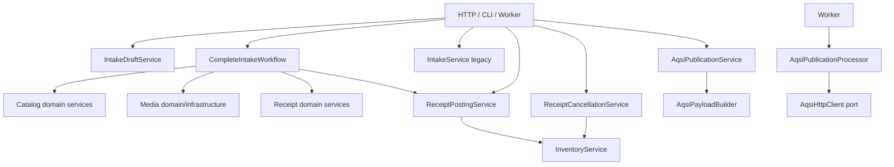

# Architecture Review v1 — Service Map

## Classification rule

Every service-like component receives exactly one primary category:

- **Application / Workflow Service** — coordinates a user/job command across entities or contexts;
- **Domain Service** — enforces rules inside one domain context;
- **Read Service** — calculates or retrieves a projection without changing business state;
- **Infrastructure Service** — filesystem, HTTP, rendering, cryptography, queue or technical mapping.

A debt marker means the current class also performs a material secondary role. It does not
automatically require a new class.

## Service inventory

| Service / component | Context | Category | Primary responsibility | Calls / uses | Architectural debt |
| --- | --- | --- | --- | --- | --- |
| `IdentityService` | Identity | Domain Service | User creation, authentication, privilege transitions and privilege audit | user/audit repositories, password helpers | Mixes read authentication and transactional commands; acceptable while identity remains small |
| `CategoryService` | Catalog | Domain Service | Category invariants and CRUD | `CategoryRepository` | Transaction-neutral; route owns finalization |
| `CatalogProductService` | Catalog | Domain Service | Product invariants and lifecycle | product/category repositories | Transaction-neutral; route or workflow owns finalization |
| `CatalogVariantService` | Catalog | Domain Service | Variant lifecycle, SKU and barcode allocation | product/variant repositories, generators | Transaction-neutral; route or workflow owns finalization |
| `SupplierService` | Supplier | Domain Service | Supplier lifecycle and normalization | supplier repository, code generator | Also owns command transactions |
| `PriceService` | Pricing | Domain Service | Append price facts and enforce currency/catalog rules | price/variant repositories | Includes read methods; conditional `commit` |
| `InventoryService` | Inventory | Domain Service | Only production writer of stock/reversal movements; quantity validation | movement/variant repositories | Also exposes balance/history reads; split only when read use grows |
| `ReceiptService` | Receipt | Domain Service | Receipt root lifecycle except posting/cancellation | receipt/supplier repositories | Transaction-neutral; list/get remain mixed with commands |
| `ReceiptItemService` | Receipt | Domain Service | Guard item changes through Receipt draft state | `ReceiptService`, item/variant repositories | Transaction-neutral; route or workflow owns finalization |
| `ImageLinkService` | Media | Domain Service | Image-link validity, target validity and primary-image uniqueness | media and catalog repositories | Transaction-neutral; cross-context target validation remains deliberate |
| `IntakeService` | Intake | Application / Workflow Service | Legacy atomic Product + Variant + primary-image command | Catalog and Media services | Legacy workflow overlaps `CompleteIntakeWorkflow`; should be retired deliberately |
| `IntakeDraftService` | Intake | Application / Workflow Service | Owned draft commands, resume, completeness and abandonment | Intake, Catalog, Supplier, Media repositories/services | **Mixed role:** commands + read projection + filesystem compensation; largest SRP debt |
| `CompleteIntakeWorkflow` | Intake | Application / Workflow Service | Idempotent atomic materialization into Catalog, Receipt, Inventory and Readiness | nine services/repositories across contexts | Cohesive workflow and sole transaction owner for Complete Intake |
| `ReceiptPostingService` | Receipt | Application / Workflow Service | Draft → posted and ledger movements | Receipt/Supplier/Catalog repositories, `InventoryService` | `post_receipt` owns a direct command; `apply_posting` participates without finalizing |
| `ReceiptCancellationService` | Receipt | Application / Workflow Service | Posted → cancelled via exact reversal movements | Receipt/Movement repositories, `InventoryService` | Explicit transaction ownership is local and clear today |
| `AqsiPublicationService` | AQSI | Application / Workflow Service | Validate, persist and enqueue-ready publication request state | AQSI repositories, payload builder, Catalog | Read methods and command methods coexist; route performs second queue-side phase |
| `AqsiPublicationProcessor` | AQSI | Application / Workflow Service | Execute remote publication state machine and persist checkpoints | AQSI gateway, payload builder, repositories | **Mixed role:** remote orchestration + persistence checkpoints + retry policy; multiple commits are intentional but undocumented |
| `VariantLabelService` | Labels | Application / Workflow Service | Authorize and assemble one printable label request | Readiness, Catalog, Pricing, renderer | Essentially a read/application query; no material debt |
| `ReadyForSaleService` | Readiness | Read Service | Derive readiness and exact missing requirements | Catalog, Media and Pricing repositories | Correctly stateless; must remain so |
| `AqsiPayloadBuilder` | AQSI | Infrastructure Service | Anti-corruption mapping from Core reads to deterministic AQSI payload | Readiness, Catalog, Pricing, Settings | Performs cross-context reads; acceptable for integration mapping |
| `ImageService` | Media | Infrastructure Service | Image metadata plus validated local source-file persistence | inspector, local storage, image repository | **Mixed role:** filesystem adapter and metadata operations; compensates only files it owns |
| `ImageInspector` | Media | Infrastructure Service | Validate bytes and extract trusted image metadata | Pillow | None |
| `LocalImageStorage` | Media | Infrastructure Service | Safe atomic local filesystem writes and deletion | filesystem | None |
| `VariantLabel58x40Renderer` | Labels | Infrastructure Service | Render deterministic PDF bytes | ReportLab/fonts | None |
| `AqsiHttpClient` | AQSI | Infrastructure Service | AQSI HTTP adapter and sanitized error mapping | `httpx2`, Settings | None |
| Queue factories / AQSI job entry point | Jobs | Infrastructure Service | Redis/RQ construction and worker session lifecycle | Redis, RQ, Settings, AQSI processor | Function-based rather than class-based; classification still applies |

## Workflow services already present under generic names

Target naming is documented in `ADR/ADR-003-workflow-layer.md`. No generic Workflow
base class or engine is proposed.

## SRP decisions

- Do not split Catalog/Supplier CRUD services merely to obtain more files.
- Keep `CompleteIntakeWorkflow` cohesive while one command owns one business outcome.
- Separate Intake draft reads from commands because the current class already has two
  independently growing reasons to change: workflow mutation and UI projection.
- Keep `ReadyForSaleService` as one read policy; do not persist its result.
- Treat AQSI processor checkpoints as a remote workflow, not as one database transaction.
