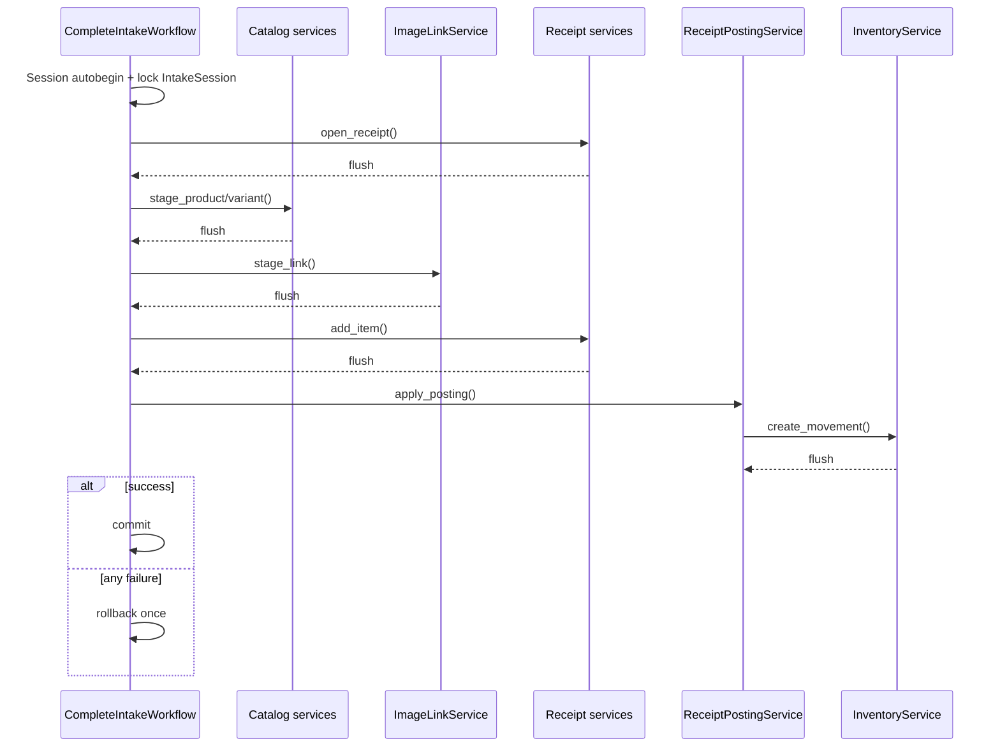

# Architecture Review v1 — Transaction Map

## How transactions currently start

SQLAlchemy `Session` uses autobegin, so the first query/write implicitly opens a
transaction. The table distinguishes this from an explicit architectural owner.
“Calls services” lists only service-to-service orchestration, not repositories.

## Current transaction behavior

| Service | Implicitly opens | Explicit flush | Commit | Rollback | Calls other services | Current transaction owner |
| --- | --- | --- | --- | --- | --- | --- |
| `IdentityService` | Yes | No | create admin; privilege transition | privilege transition only | No | Itself for commands |
| `CategoryService` | Yes | every write | Never | Never | No | HTTP command caller |
| `CatalogProductService` | Yes | every write | Never | Never | No | HTTP command or workflow caller |
| `CatalogVariantService` | Yes | every write | Never | Never | No | HTTP command or workflow caller |
| `SupplierService` | Yes | No | every write | No | No | Itself |
| `PriceService` | Yes | every write | Never | Never | No | HTTP command caller |
| `ImageService` | Yes for metadata | every metadata write | Never | Never | Inspector + storage | HTTP/Intake command; Media compensates only its file |
| `ImageLinkService` | Yes | every write | Never | Never | No | HTTP/Intake command caller |
| `ReceiptService` | Yes | every write | Never | Never | No | HTTP command or workflow caller |
| `ReceiptItemService` | Yes | every write | Never | Never | `ReceiptService` read/guard methods | HTTP command or workflow caller |
| `InventoryService` | Yes | every movement/reversal | Never | Never | No | Deliberately delegates ownership |
| `ReceiptPostingService` | Yes | `apply_posting` plus nested inventory flushes | `post_receipt` once | `post_receipt` once; `apply_posting` never | `InventoryService` | Direct command owns; caller owns explicit participant operation |
| `ReceiptCancellationService` | Yes | nested reversal flushes | once | once on exception | `InventoryService` | Itself |
| `IntakeService` (legacy) | Yes | nested service flushes | once | once on exception | transaction-neutral Catalog + ImageLink services | Itself |
| `IntakeDraftWorkflow` | Yes | nested image upload | each command | add-new outer rollback only | transaction-neutral `ImageService`; `IntakeDraftReadService` after successful commands | Itself; Media compensates only its filesystem write |
| `IntakeDraftReadService` | Read transaction | No | No | No | pure completeness policy | None; read-only |
| `ActivityEventService` | Participates in caller transaction | No | Never | Never | No | Intake command/workflow caller |
| `ActivityReadService` | Read transaction | No | No | No | No | None; read-only |
| `CompleteIntakeWorkflow` | Yes; row lock | own final flush + explicit staged domain operations | once; also commit on idempotent retry to release lock | once on exception | Catalog, ImageLink, Receipt, Posting, Readiness | Sole owner of Complete Intake |
| `ReadyForSaleService` | Read transaction | No | No | No | No | None; read-only |
| `VariantLabelService` | Read transaction | No | No | No | Readiness + renderer | None; read-only |
| `AqsiPayloadBuilder` | Read transaction | No | No | No | Readiness | None; read-only |
| `AqsiPublicationService` | Yes; row locks | publication creation | request and enqueue-failure commands | No explicit rollback | Payload builder | Itself per local command |
| `AqsiPublicationProcessor` | Yes; row locks | No explicit | processing, accepted, published or failed checkpoints | No explicit rollback | Payload builder + external gateway | Itself, across multiple intentional local transactions |
| `AqsiHttpClient`, renderer, inspector, storage | No DB transaction | File `flush` is not SQL flush | No | No DB rollback | Infrastructure only | N/A |

## Transaction topology in Intake completion

AB-002 makes the workflow the only finalizer. Nested services may flush rows required by the
next operation, but they neither commit nor rollback the caller-owned transaction.

## Findings

### `commit=False`

`commit=False` began as a pragmatic way to reuse validated Catalog/Media operations inside
`IntakeService`. AB-003 removed the transaction-mode boolean from production services. HTTP
commands and named workflows now finalize writes explicitly.
At this breadth it is still no longer merely a
local compromise: it is a transaction-protocol encoded as optional booleans across domain APIs.

Three proportional options:

| Option | Description | Advantages | Disadvantages | Decision |
| --- | --- | --- | --- | --- |
| A. Keep and document flags | Retain current methods; require workflows to pass `commit=False` | Lowest change risk; current tests already cover behavior | Transaction owner remains hidden; easy to omit a flag; every new workflow spreads the convention | Accept only as short-lived stabilization |
| B. Boundary-owned transaction | One HTTP/CLI/job command boundary finalizes the request-scoped transaction; domain services never commit/rollback and flush only for generated IDs | One owner; composable services; no new framework or UoW; works with current Session | Requires incremental signature/test migration; the mechanism must account for authentication already triggering Session autobegin | **Recommended target** |
| C. Lightweight transaction runner | A small application helper runs a command callback inside `session.begin()` | Centralized boilerplate and logging; easy consistency | Can become hidden magic/decorator coupling; still requires services to stop committing; resembles a UoW if overbuilt | Reconsider only after Option B shows repeated boilerplate |

Direct repository orchestration is not a fourth acceptable solution: it would remove
`commit=False` by bypassing domain validation.

### Double commit and multi-commit workflows

- No accidental double commit was found in Intake completion.
- AQSI request plus queue-failure recording uses two separate local commands; this is correct
  because Redis enqueue cannot share the PostgreSQL transaction.
- AQSI processor intentionally commits `processing`, `accepted`, then `published/failed`
  around remote side effects. These are workflow checkpoints, not one atomic transaction.
  The policy must be documented and tested, not collapsed into one long DB transaction.

### Rollback ownership

- `CompleteIntakeWorkflow` performs the only rollback for Complete Intake.
- Direct `ReceiptPostingService.post_receipt` owns one rollback; nested `apply_posting` owns none.
- `IntakeDraftWorkflow.add_new_item` owns SQL rollback while nested Media compensates only its
  filesystem write.
- Characterization tests cover all three boundaries.

### Session leakage

Routes create services around a request-scoped raw `Session`, services return ORM entities,
and read services sometimes rely on lazy relationships (`variant.product`). This is acceptable
for the current monolith, but the session lifetime is an undocumented public assumption.
Do not introduce repository interfaces or DTO mapping everywhere now; document the request/job
scope and add eager loading where a concrete detached/lazy-loading failure appears.

## Target invariant

> One command has one transaction owner: the outermost Application/Workflow boundary.
> Domain, Read and Infrastructure services never commit or rollback a caller’s transaction.

With the current FastAPI dependencies, `get_current_user` queries through the same request-scoped
Session before the route command runs. Therefore a workflow must not blindly call
`session.begin()` after authentication. The migration must either let the outer command perform
the single final commit/rollback on that autobegun transaction, or introduce a transaction-scoped
dependency that encloses authentication and the command together. This choice is part of AB-002.

The detailed decision and exceptions are in `ADR/ADR-002-transaction-ownership.md`.
