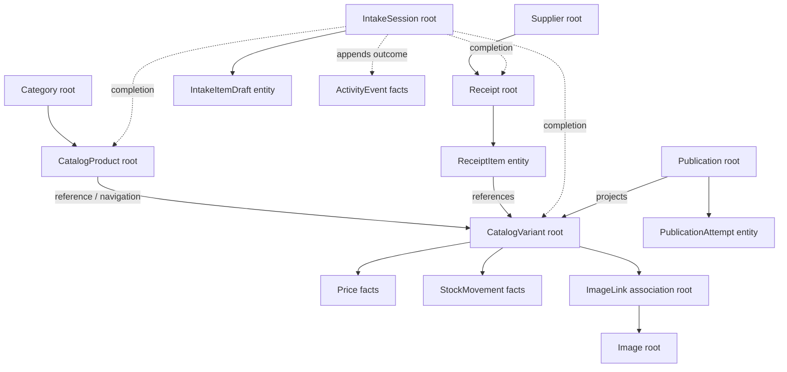
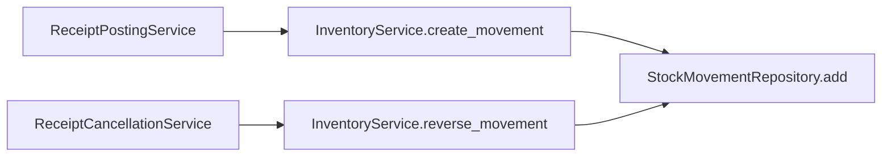
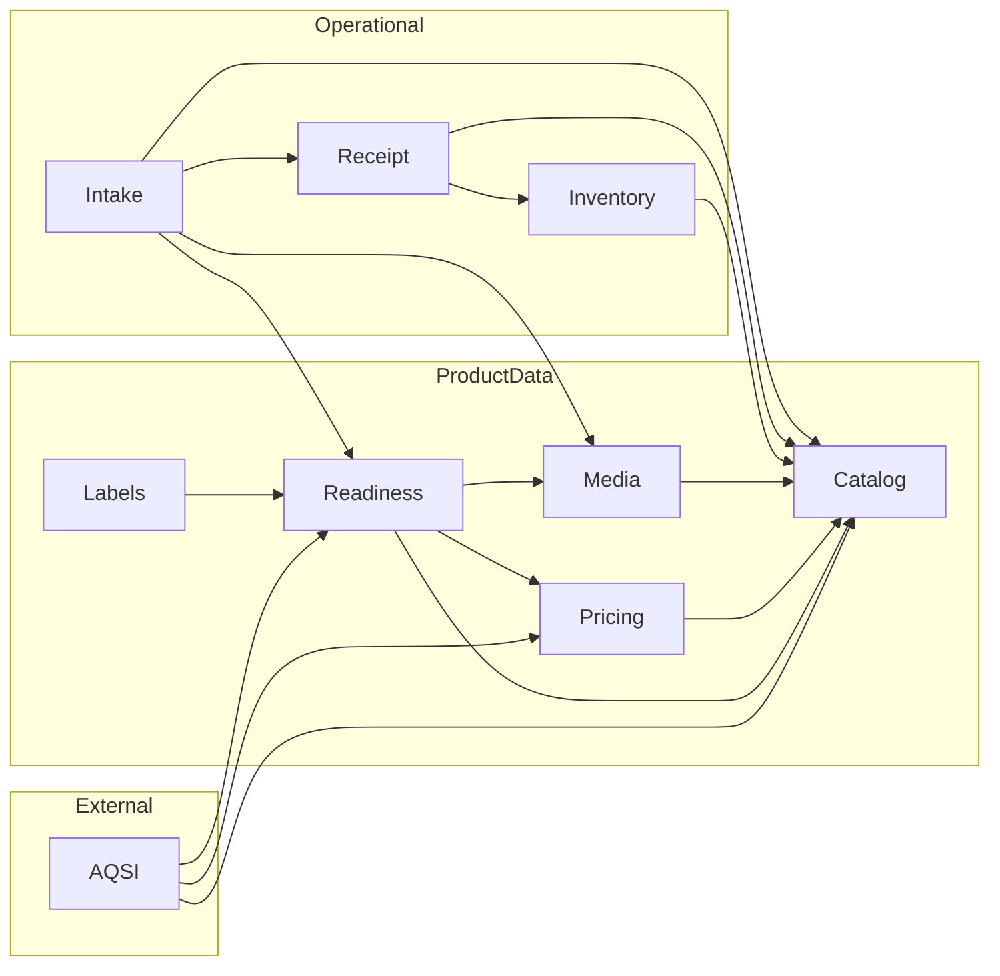

# Architecture Review v1 — Domain Model and Context Boundaries

## Aggregate map

The labels describe effective transactional boundaries, not ORM relationship shape.

| Context | Aggregate Root | Entities inside boundary | Value Objects / value-like policies | Domain Service | Boundary assessment |
| --- | --- | --- | --- | --- | --- |
| Identity | `User` | `PrivilegeAuditEvent` belongs to a privilege change history | normalized email, password policy, `PrivilegeAuditAction` | `IdentityService` | Privilege change and event commit atomically; boundary is sound |
| Catalog | `Category`; `CatalogProduct`; `CatalogVariant` as three independently addressed roots | Category tree nodes; Product-to-Variant ORM relationship is navigational | SKU, internal EAN-13 barcode, slug, attributes; generators are value-like policies | Category/Product/Variant services | Variant must remain a separate root because Receipt, Price, Stock, Media and AQSI reference it independently |
| Media | `Image`; `ImageLink` as association root | No owned child collection with joint lifecycle | source key, checksum, dimensions, link role/target | `ImageLinkService` | Polymorphic `entity_type/entity_id` has no FK and validates Catalog directly; Rental will expand this pressure point |
| Supplier | `Supplier` | None | supplier code, normalized display/legal names | `SupplierService` | Sound reference-data aggregate |
| Receipt | `Receipt` | `ReceiptItem` | receipt number, quantity, purchase money, status | Receipt and ReceiptItem domain services | Item API always includes Receipt ID and enforces draft root state; boundary is sound |
| Inventory | `StockMovement` as append-only ledger fact | None; balance is projection, not entity | signed quantity delta, `MovementType`, `SourceType` | `InventoryService` | Sound if all writes stay behind InventoryService; no stored Stock aggregate exists |
| Pricing | `Price` as append-only fact; conceptual history keyed by Variant/type | None | money, currency, effective time, `PriceType` | `PriceService` | Sound for current scale; current price is a query, never a mutable field on Variant |
| Intake | `IntakeSession` | `IntakeItemDraft` | item kind, missing-requirement sets, lifecycle status | `IntakeDraftWorkflow`, `CompleteIntakeWorkflow` | Root boundary is sound; commands and projections are separated while completeness remains derived |
| Activity | `ActivityEvent` as append-only fact | None | namespaced event type, entity reference, bounded operational payload | `ActivityEventService` | Events join the owning Intake transaction; no mutation/delete API or generic event bus exists |
| AQSI publication | `Publication` | `PublicationAttempt` | channel, operation/status, canonical payload hash | publication request and processor workflows | Attempt belongs to Publication; remote checkpoints intentionally span multiple local transactions |
| Readiness | No persisted aggregate | None | `ReadyForSaleRequirement` list and `is_ready` projection | `ReadyForSaleService` | Correctly a computed read model; persisting it would create synchronization debt |
| Labels | No aggregate | None | `VariantLabelData`, physical 58×40 template | None; application service + renderer | Correct read/output context |
| Rental | Not implemented | Future `Asset`, inspections, rental contract items | Future asset code, condition, seal, rental period | Not implemented | Do not force into Product/Variant or Inventory aggregate before journey design |

## Effective aggregate graph

## Aggregate-boundary findings

### Catalog Product and Variant

The ORM exposes `CatalogProduct.variants`, but treating Product plus every Variant as one
aggregate would be incorrect. Variant has its own public API, lifecycle, SKU/barcode, price,
stock movements, labels and external publications. Locking or loading Product for every Variant
operation would add contention without enforcing a real invariant. Keep them separate roots with
an active-Product reference check in Variant creation/update.

### Receipt and ReceiptItem

The aggregate is respected: item commands identify the Receipt, verify it is a draft and then
change a line. Posting locks the Receipt root and emits ledger facts. Direct public mutation of
ReceiptItem outside the aggregate was not found.

### Inventory

There is one production construction path for stock changes:

No production code instantiates `StockMovement` or calls repository `add` outside
`InventoryService`. The repository is technically importable, so the boundary is convention- and
test-protected rather than language-enforced. Preserve this single write gate when Sales, Rental
and Inventory Adjustment workflows arrive.

### Intake

`IntakeSession` correctly owns item drafts and is locked for completion. Completion updates item
mappings, creates other aggregates through their services and links the resulting Receipt. This
is cross-aggregate workflow coordination, not an aggregate violation.

The legacy `IntakeService` is a competing workflow: it creates Product/Variant/ImageLink without
an IntakeSession or Receipt. It does not violate database constraints, but it bypasses the newly
defined operational aggregate and should be deprecated before the phone UI depends on it.

### Media association

`ImageLink` uses a polymorphic target without a database FK. Today `ImageLinkService` knows only
Catalog Product/Variant. Adding Rental targets by extending `if/else` would couple Media to every
future context. Do not generalize pre-emptively; introduce a small target-validation registry or
explicit Rental media command only when Rental is implemented.

## Value-object assessment

SKU, barcode, receipt number, supplier code and money are stored as primitives and protected by
generators/normalizers. This is mild primitive obsession, not a current correctness failure.
Strong Python value-object wrappers would affect schemas, ORM types and integrations. Defer them
until a second format/currency or repeated invalid-state bug creates practical benefit.

## Bounded-context dependency graph

### Cycle and pressure-point result

- Current directed graph has no context cycle.
- The highest fan-out is Intake by design; it is an Application/Workflow context.
- Readiness is intentionally a cross-context query and must not be imported back into Catalog,
  Media or Pricing. Such a reverse import would create a real cycle.
- AQSI and Labels should consume Readiness; authoritative contexts must never depend on either.
- Intake directly imports foreign repositories for validation/projection. Replace these only when
  touching the relevant workflow; do not create interfaces for every repository in advance.
