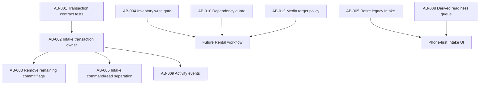

# Architecture Backlog v1 — Core ERP

## Purpose and ordering

This is an executable architecture backlog for the current modular monolith. It does not propose
a rewrite. Tasks are ordered by dependency and risk, not by architectural fashion.

Priority meanings:

- **P0** — consistency risk that should be resolved before adding more write workflows;
- **P1** — next-sprint enabler or debt that will become expensive soon;
- **P2** — controlled improvement when the affected area is next changed;
- **P3** — deliberate deferral; implement only after a concrete trigger.

## Audit summary

| Area | Result |
| --- | --- |
| Context cycles | None found |
| Inventory mutation | One production path through `InventoryService`; protect it |
| Readiness | Fully derived; no persisted ready flag or missing-requirement state |
| Repository business logic | No material invariant bypass; sequence reservation/fallback parsing is a mild persistence concern only |
| Transaction ownership | Complete Intake and direct context commands have explicit owners; AB-003 is complete |
| God services | None proven; Intake draft commands and projections are separated without fragmenting individual commands |
| SQLAlchemy Session leakage | Request/job-scoped ORM reliance is widespread but acceptable; lifetime and lazy-loading policy are undocumented |
| Legacy bypass | `POST /api/intake` is deprecated but remains operational until usage and removal-window checks pass |

## Dependency order

---

## AB-001 — Freeze the transaction contract with tests

- **Priority:** P0
- **Engineering name:** `transaction-boundary-characterization`
- **Status:** Completed on 2026-07-19
- **Estimate:** S
- **Dependencies:** None

### Why this is a problem

`commit=False`, nested rollback and implicit Session autobegin form an undocumented protocol.
Existing outcome tests are strong, but they do not state which layer is allowed to finalize a
transaction.

### Why now

Rental, Activity Events and the phone workflow will add new multi-aggregate commands. Changing
ownership after those commands exist multiplies migration risk.

### Proposed solution

Adopt ADR-002 and add characterization tests for ownership before changing behavior. Tests should
prove: one successful commit, one rollback on late failure, no nested commit, persisted source
photo survives Intake completion failure, and AQSI checkpoints remain intentionally separate.

### Implementation plan

1. Add Session spies/counters around Intake complete, Receipt post and media upload failure tests.
2. Add a late-failure test after inventory flush and before outer commit.
3. Add a test that direct Receipt posting remains atomic.
4. Document AQSI’s separate local transactions in test names/fixtures.
5. Treat these tests as migration acceptance criteria for AB-002/003.

### Risks

Over-specifying SQLAlchemy implementation details could make harmless refactors painful. Assert
ownership and durable outcomes, not every internal flush count.

### Completion evidence

- successful Intake completion performs one outer commit;
- a failure after ledger flush performs no commit and one outer rollback;
- the same late failure removes catalog, Receipt, image-link and ledger writes while preserving
  the resumable draft and its already persisted source photo;
- direct Receipt posting commits once and rolls back once on movement failure;
- failed image metadata persistence compensates the saved source file;
- AQSI creation explicitly persists three local checkpoints: processing, accepted and published.

The tests intentionally assert transaction ownership and durable outcomes. They do not freeze
internal flush counts. They are the acceptance baseline for AB-002 and AB-003.

---

## AB-002 — Make Intake completion the sole transaction owner

- **Priority:** P0
- **Engineering name:** `intake-transaction-ownership`
- **Status:** Completed on 2026-07-19
- **Estimate:** L
- **Dependencies:** AB-001

### Why this is a problem

Before AB-002, `IntakeCompletionService` intended to own one atomic command but called
`ReceiptPostingService(commit=False)`, which can rollback the shared Session internally. Outer and
nested rollback both ran. Catalog, Media and Receipt participation was selected through
boolean transaction flags.

### Why now

Intake is the first core daily workflow and the template for Rental. Its boundary should be clear
before the phone UI and operational events depend on it.

### Proposed solution

Make Complete Intake the only finalizer of its request-scoped transaction. Choose a mechanism that
works with authentication already triggering Session autobegin: either one explicit outer
commit/rollback or a dependency scope that encloses auth and command work. Make nested domain
operations transaction-neutral and keep direct Receipt posting as its own outer workflow command.

### Implementation plan

1. Characterize FastAPI dependency order, auth autobegin and commit-failure media compensation.
2. Choose and document the concrete outer transaction scope.
3. Introduce transaction-neutral Catalog/Media/Receipt operations used by completion without
   creating duplicate domain validation.
4. Remove rollback from nested Receipt posting participation.
5. Keep filesystem compensation local to Media; remove its ability to rollback caller SQL state.
6. Run AB-001 and all Intake/Receipt/Inventory tests.
7. Remove Intake-specific `commit=False` call sites only after equivalent tests pass.

### Risks

Generated SKU/Receipt sequences can retain gaps after rollback; this is expected. Incorrect flush
placement can break FK-dependent creation. Image filesystem compensation must still work when DB
commit fails.

### Completion evidence

- `CompleteIntakeWorkflow` replaced the generic completion-service name and owns the single final
  commit/rollback over the existing request-scoped Session;
- the workflow uses explicit staged Catalog, ImageLink and Receipt operations without transaction
  booleans;
- nested Receipt posting uses `apply_posting` and never finalizes the shared Session;
- direct Receipt posting remains a separately atomic command;
- nested Media upload compensates only its filesystem write; the Intake command owns SQL rollback;
- tests prove one successful commit, one rollback after a late failure, one rollback after nested
  posting failure, durable Photo First input, and unchanged ledger atomicity.

Remaining `commit=False` APIs are intentionally left for AB-003, while the legacy one-shot Intake
workflow is left for AB-005.

---

## AB-003 — Retire transaction-mode booleans context by context

- **Priority:** P1
- **Engineering name:** `remove-commit-flags`
- **Status:** Completed on 2026-07-19
- **Estimate:** L
- **Dependencies:** AB-002

### Why this is a problem

`commit=False` exists across Catalog, Media, Pricing, Receipt and Posting. It mixes business API
with transaction protocol and makes every service conditionally an owner or participant.

### Why not all at once

A repository-wide signature rewrite has little user value and high regression risk. Migration
should follow active workflows and context tests.

### Proposed solution

Apply ADR-002 incrementally. For simple CRUD, the route/CLI command owns an explicit transaction;
for cross-context commands, a named workflow owns it. Domain services do not finalize Sessions.

### Implementation plan

1. Inventory all remaining boolean call sites after AB-002.
2. Migrate Receipt direct commands, then Catalog/Media, then Pricing.
3. Replace explicit service rollback with context-manager rollback.
4. Remove each boolean only when no call site relies on it.
5. Do not add a UnitOfWork or decorator during this task.

### Risks

Temporary mixed conventions are confusing; track migrated contexts in this backlog. Route tests
must catch missing commits. Avoid one giant PR.

### Progress

- [x] Receipt and ReceiptItem domain commands are transaction-neutral.
- [x] Receipt HTTP commands explicitly commit once and rollback failures.
- [x] Direct Post/Cancel Receipt workflows retain their own clear transaction boundary.
- [x] Catalog command APIs and routes are transaction-neutral/explicit owners respectively.
- [x] Media metadata/link commands are transaction-neutral and HTTP owns finalization.
- [x] Pricing commands are transaction-neutral and the HTTP command owns finalization.
- [x] Transitional staged aliases are removed; workflows use the same domain methods as adapters.

### Completion evidence

- no production service accepts a transaction-mode boolean;
- Receipt, Catalog, Media and Pricing domain operations flush but never commit or rollback;
- direct HTTP commands explicitly finalize their shared request-scoped Session;
- Complete Intake remains the sole owner across Catalog, Media, Receipt and Inventory;
- upload commit failure rolls back metadata and compensates the saved source file;
- AQSI checkpoint commits and direct Receipt Post/Cancel workflow commits remain intentional and
  outside the removed boolean protocol.

---

## AB-004 — Protect the single Inventory write gate

- **Priority:** P1
- **Engineering name:** `inventory-write-gate`
- **Estimate:** S
- **Dependencies:** AB-001; required before Rental writes stock

### Why this is a problem

Production code currently creates movements only through `InventoryService`, but
`StockMovementRepository.add` and the ORM model are importable. Future Sales/Rental work could
accidentally bypass quantity/source/active-Variant rules.

### Why now

There is no current bypass, so this is not P0. It becomes important immediately before the second
inventory-writing context is introduced.

### Proposed solution

Declare `InventoryService.create_movement/reverse_movement` the only production write API and add
a lightweight architecture test or documented import rule. Do not make the ledger repository a
new service or hide SQLAlchemy behind interfaces.

### Implementation plan

1. Add an architecture test scanning production constructors/calls for `StockMovement` writes.
2. Document allowed callers and source types.
3. Require new Sales/Rental workflows to call InventoryService.
4. Keep balance/history reads unchanged until usage justifies a separate read service.

### Risks

A brittle text scan can flag migrations or tests; scope it to `src/core` and allow the Inventory
module itself.

---

## AB-005 — Deprecate the legacy one-shot Intake API

- **Priority:** P1
- **Engineering name:** `retire-legacy-intake`
- **Status:** Deprecation phase completed on 2026-07-22; removal is intentionally deferred
- **Estimate:** S
- **Dependencies:** Confirm phone client uses IntakeSession API; AB-002 preferred

### Why this is a problem

Legacy `POST /api/intake` creates Product, Variant and primary ImageLink without an IntakeSession,
Supplier, Receipt or ledger movement. It competes with the documented operational workflow.

### Why not delete immediately

It may still be used for development or hidden clients. Removal without usage confirmation would
be a needless compatibility break.

### Proposed solution

Mark the endpoint deprecated in OpenAPI, measure/inspect usage, then remove `IntakeService` after
the first-party phone workflow uses session completion.

### Implementation plan

1. Mark route deprecated and document replacement endpoints.
2. Search clients/scripts and production access logs.
3. Add a release-note removal window.
4. Remove route/service/tests only after confirmed unused.

### Risks

Unknown manual integrations may break. Keep migration instructions concise.

### Progress

- [x] Mark `POST /api/intake` deprecated in OpenAPI without changing its behavior.
- [x] Point API consumers to the resumable IntakeSession item and completion commands.
- [x] Replace the legacy endpoint in the primary architecture example.
- [x] Search repository clients and scripts; only compatibility/authentication tests call it.
- [x] Document the minimum removal window and required usage confirmation.
- [ ] Check production access logs or known external clients before removal.
- [ ] Announce the concrete removal release after the first-party phone workflow is active.
- [ ] Remove the route, `IntakeService`, schemas and compatibility tests after that window.

---

## AB-006 — Separate Intake commands from draft projections

- **Priority:** P1
- **Engineering name:** `intake-command-read-separation`
- **Status:** Completed on 2026-07-22
- **Estimate:** M
- **Dependencies:** AB-002

### Why this is a problem

`IntakeDraftService` mutates sessions, uploads/compensates files, lists sessions, builds response
DTOs and calculates missing requirements. It has multiple reasons to change and is already the
largest mixed-role service.

### Why now

The phone UI will expand resume/list/projection needs independently from command rules.

### Proposed solution

Keep one `IntakeDraftWorkflow` for mutation and introduce one `IntakeDraftReadService` for owned
session projections and missing requirements. Share a small pure completeness policy only if both
need it. Do not split every command into a class.

### Implementation plan

1. Extract pure item/session completeness calculation with tests.
2. Move list/get/DTO projection into the read service.
3. Keep create/update/add/abandon commands together.
4. Preserve API schemas and endpoint behavior.

### Risks

Premature extraction can duplicate repository queries. Measure N+1 behavior and keep selectinload.

### Completion evidence

- `IntakeDraftWorkflow` owns create, update, add and abandon commands and their transactions;
- `IntakeDraftReadService` exclusively owns list/detail projections and derived requirements;
- HTTP read routes no longer construct local image-storage infrastructure;
- item and session completeness live in a pure policy with direct unit tests;
- referenced Catalog and Media availability is resolved in bounded bulk queries after Intake
  items are loaded with `selectinload`;
- API schemas, ownership behavior and resumable workflow responses remain unchanged.

---

## AB-007 — Formalize AQSI checkpoint transactions

- **Priority:** P1
- **Engineering name:** `aqsi-checkpoint-ownership`
- **Estimate:** M
- **Dependencies:** ADR-002; independent of AB-002 implementation

### Why this is a problem

`AqsiPublicationProcessor` mixes remote orchestration, retry polling and several commits. The
multiple transactions are correct, but ownership and stale-ORM behavior across commits are only
implicit.

### Why now

AQSI is live and handles real products. Reliability work is more valuable than renaming classes.

### Proposed solution

Model the processor explicitly as a sequence of short local checkpoint transactions separated by
network work. Reload state at checkpoint boundaries where needed; never keep row locks during
polling. Keep the existing injectable gateway.

### Implementation plan

1. Document state transitions and retryable/non-retryable outcomes in tests.
2. Verify locks are released before every remote call and sleep.
3. Encapsulate each local state transition in one explicit transaction helper local to AQSI.
4. Test worker crash/retry after `processing` and `accepted` checkpoints.
5. Do not introduce an Event Bus or distributed transaction.

### Risks

Changing retry semantics may duplicate remote requests. Preserve idempotent external ID and
payload hash behavior.

---

## AB-008 — Build the Ready for Sale attention queue as a read model

- **Priority:** P1
- **Engineering name:** `readiness-attention-query`
- **Status:** Completed on 2026-07-22
- **Estimate:** M
- **Dependencies:** None; coordinate with phone UI

### Why this is a problem

Single-Variant readiness is correct, but the employee workflow needs a queue of unresolved
Variants. A tempting shortcut is a persisted `ready` status, which would drift from Media/Pricing.

### Why now

This is a direct Sprint 8 product outcome and validates the derived-readiness architecture.

### Proposed solution

Add a batch `ReadyForSaleReadService` query returning current missing requirements, filters and
ordering. Keep readiness fully computed; no readiness table, event synchronization or manual
dismiss flag.

### Implementation plan

1. Define queue query/filter DTOs.
2. Implement a bounded SQL/read-service query without N+1 repository loops.
3. Reuse the same policy constants as single-Variant readiness.
4. Add API pagination and tests proving fixes disappear automatically.

### Risks

Naive per-Variant checks will scale poorly. Avoid premature materialized views; optimize the SQL
query first.

### Completion evidence

- `GET /api/readiness/attention` returns protected, paginated employee work with an optional
  machine-readable requirement filter;
- `ReadyForSaleReadService` loads Catalog, primary-image existence and latest effective retail
  price facts in one bounded SQL statement without per-Variant reads;
- single-Variant checks and the queue share one pure requirement policy and stable reason order;
- ready, intentionally inactive and archived Variants are excluded from employee work;
- text/SKU search, exact barcode lookup and oldest-created-first ordering support daily triage;
- each queue item includes the primary Image ID when one is available;
- adding missing facts removes the Variant from the next response without stored readiness state;
- tests cover ordering, filtering, pagination, authentication, automatic disappearance and query
  count.

---

## AB-009 — Add meaningful Activity Events after transaction ownership

- **Priority:** P1
- **Engineering name:** `operational-activity-events`
- **Estimate:** M
- **Dependencies:** AB-002; event specification in `docs/19_operational_visibility.md`

### Why this is a problem

Actor IDs exist on entities, but there is no employee feed or append-only operational outcome
stream. Adding events before transaction ownership is clear risks committing an event separately
from the business action.

### Why now / why wait

It is important for hiring and operational visibility, but must wait until the command owner can
append the event in the same transaction.

### Proposed solution

Persist a small `ActivityEvent` fact only for meaningful outcomes. The owning workflow appends it
inside its transaction. No Event Bus, click tracking or generic audit copy.

### Implementation plan

1. Implement only the five Intake event types already documented.
2. Append completion/abandon events within the workflow transaction.
3. Add employee read feed separately.
4. Derive duration/count metrics from domain/event timestamps.

### Risks

Payload creep and personal-data duplication. Enforce a small schema and retention policy later.

---

## AB-010 — Add a bounded-context dependency guard

- **Priority:** P2
- **Engineering name:** `context-import-guard`
- **Estimate:** S
- **Dependencies:** Agree on module map; complete before Rental expands Media/Inventory usage

### Why this is a problem

There are no cycles today, but Python permits any context to import any repository. A reverse
Readiness→authoritative dependency or Inventory→Receipt import could silently create cycles.

### Why not P1

The current graph is healthy and small. A guard is preventive, not a present defect.

### Proposed solution

Add a small architecture test defining forbidden reverse imports and approved workflow fan-out.
Do not introduce an external dependency-injection or architecture framework.

### Implementation plan

1. Encode the graph from `01_module_map.md` as allowed/forbidden edges.
2. Scan imports under `src/core` in tests.
3. Allow adapters to depend on identity/shared infrastructure.
4. Update intentionally when a reviewed context edge is added.

### Risks

Overly strict rules can block practical monolith work. Guard only cycles and authoritative
direction, not every import.

---

## AB-011 — Document Session lifetime and eliminate concrete lazy-load hazards

- **Priority:** P2
- **Engineering name:** `session-lifetime-policy`
- **Estimate:** S
- **Dependencies:** ADR-002 migration direction

### Why this is a problem

Services return ORM entities and some reads rely on lazy relationships. This works with the
request/job-scoped Session but is not documented and can fail if serialization/rendering moves
outside the scope.

### Why not rewrite now

Mapping every ORM entity to DTOs or repository interfaces would be disproportionate. No current
production failure demonstrates the need.

### Proposed solution

Document Session scope and require explicit eager loading only for data that crosses a scope or is
used after commit. Add tests around known artifact/job boundaries.

### Implementation plan

1. Document HTTP, CLI and worker Session lifetimes.
2. Identify lazy relations used by Labels/AQSI response construction.
3. Add eager repository queries where a detached-use test requires them.
4. Avoid global `expire_on_commit` changes without evidence.

### Risks

Eager loading everything can create oversized queries; fix concrete access paths only.

---

## AB-012 — Defer generalized Media targets until Rental design

- **Priority:** P2
- **Engineering name:** `media-target-policy`
- **Estimate:** M when triggered
- **Dependencies:** Rental aggregate and journeys must be designed first

### Why this is a problem

ImageLink target validation is hard-coded to Catalog Product/Variant. Rental will need Asset and
Inspection photos, but a generic polymorphic registry now would be speculative.

### Why specifically not now

Rental entities and ownership rules do not exist. Generalizing today risks an untyped “attach
anything to anything” model.

### Proposed solution

Keep current validation. During Rental Foundation, choose between explicit Rental media commands
and a small registered target validator. Preserve mandatory condition-photo invariants in Rental,
not in generic Media.

### Implementation plan

1. Design Asset/Inspection aggregate ownership.
2. List allowed image roles and lifecycle rules.
3. Select the smallest validation extension.
4. Add FK-equivalent application checks and cleanup policy tests.

### Risks

Polymorphic links lack database FK enforcement; validation and deletion policy must be explicit.

---

## AB-013 — Keep primitive identifiers until a real format trigger

- **Priority:** P3
- **Engineering name:** `defer-value-object-wrappers`
- **Estimate:** L if triggered
- **Dependencies:** A second currency/code format or repeated validation defects

### Why this is a problem

Money, SKU, barcode and document codes are primitive fields protected by generators. Strong value
objects could improve type safety.

### Why specifically not to fix

Current rules are centralized and tested. Wrappers would touch ORM mappings, Pydantic schemas,
AQSI payloads, labels and migrations without a present business payoff.

### Proposed solution

Keep generators/normalizers as value-like policies. Revisit only when multiple formats,
currencies or recurring invalid-state bugs make primitives costly.

### Implementation plan

1. Record the concrete trigger.
2. Introduce one value object at a boundary, not all identifiers together.
3. Preserve storage representation and API compatibility where possible.

### Risks

Large compatibility surface and serialization friction. No work should be scheduled from this
item without a trigger.

## Recommended next sequence

1. AB-009 — add meaningful Activity Events inside the established transaction boundaries.
2. AB-004 and AB-010 — protect Inventory writes and context direction before Rental Foundation.
3. AB-007 — harden AQSI checkpoint recovery as the next integration reliability increment.
4. Complete AB-005 removal only after its documented client and release-window checks pass.
5. P2/P3 tasks only when their stated trigger occurs.
