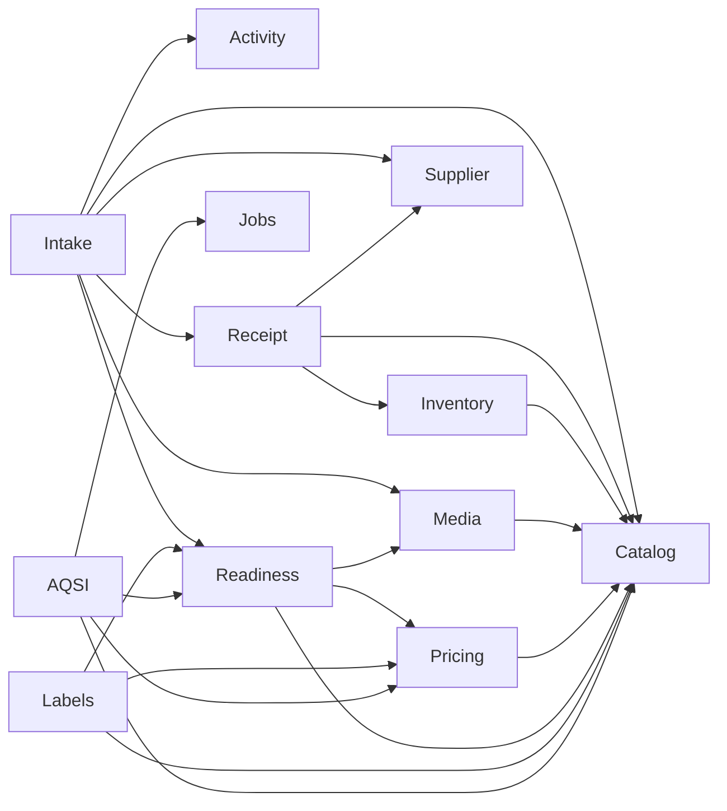

# Architecture Review v2 — Sprint 8 Conformance

## Scope and baseline

Audit baseline: `main` at `49acd72`, tag `v0.5.0`, after Sprint 8 — Workflow UX.
The previous release baseline is `065f176`, tag `v0.4.0`. Sprint 8 is described by
`planning/done.md:96`, `planning/current.md:3` and `docs/releases/v0.5.0.md:1`.

The existing architecture was treated as the decision baseline, not redesigned:

- Core is the Single Source of Truth and uses API, service, repository and isolated integration
  layers (`docs/04_architecture.md:58`, `docs/04_architecture.md:101`);
- Product is a family and Variant is the independently addressed sellable unit
  (`docs/04_architecture.md:167`, `src/core/catalog/models.py:40`,
  `src/core/catalog/models.py:67`);
- stock is an SQL-derived projection over immutable `StockMovement` facts
  (`docs/04_architecture.md:183`, `src/core/inventory/models.py:22`);
- prices are separate append-only facts (`docs/04_architecture.md:197`,
  `src/core/pricing/models.py:18`);
- images use universal `Image` + `ImageLink` records (`docs/04_architecture.md:215`,
  `src/core/media/models.py:15`, `src/core/media/models.py:38`);
- Ready for Sale is derived from authoritative facts and is not persisted
  (`docs/architecture_review/ADR/ADR-003-workflow-layer.md:45`,
  `src/core/readiness/policy.py:22`);
- one outer command owns transaction finalization
  (`docs/architecture_review/ADR/ADR-002-transaction-ownership.md:28`);
- cross-context commands use explicit, use-case-specific workflows without an engine
  (`docs/architecture_review/ADR/ADR-003-workflow-layer.md:14`).

## Existing ADR status

| ADR | Status in repository | Audit status | Evidence |
| --- | --- | --- | --- |
| ADR-002 — Transaction Ownership | Accepted | Partially fulfilled | Catalog, Media, Pricing and Receipt CRUD are transaction-neutral and route-owned; Complete Intake has one owner. `SupplierService` and `IdentityService` still finalize their own commands. See transaction inventory below. |
| ADR-003 — Explicit Workflow Layer Without an Engine | Accepted | Current and substantially fulfilled | `IntakeDraftWorkflow` and `CompleteIntakeWorkflow` are explicit use-case classes (`src/core/intake/draft_service.py:66`, `src/core/intake/completion.py:47`). Generic-named Receipt and AQSI workflow services remain exactly as the ADR permits. |

No existing ADR is obsolete. No finding in this audit by itself requires an immediate new ADR.
Sprint 9 will require an explicit decision record only if the discussion selects new ownership
rules for Rental Asset, checkout/return, Media targets or Inventory interaction that are not
already covered by ADR-002/003 and the domain documentation.

## Previously recorded risks and Sprint 8 response

| Previous item | Sprint 8 intent | Current result |
| --- | --- | --- |
| AB-002, hidden transaction ownership | Establish one owner and remove nested finalization | Completed for Intake completion and Catalog/Media/Receipt/Pricing command composition. `CompleteIntakeWorkflow.complete` owns commit/rollback (`src/core/intake/completion.py:69-150`). |
| AB-003, workflows hidden under generic services | Name explicit workflow/application layer | `IntakeDraftWorkflow` and `CompleteIntakeWorkflow` are explicit; command/read separation exists (`src/core/intake/read_service.py:26`). |
| AB-005, legacy Intake | Deprecate after replacement | Endpoint remains callable but is marked deprecated (`src/core/intake/routes.py:96-110`). |
| AB-008, employee Ready for Sale queue | Keep readiness derived | Shared pure policy and attention read service exist (`src/core/readiness/policy.py:10-43`, `src/core/readiness/read_service.py:22-144`). |
| AB-009, meaningful activity | Append outcomes in owning transactions | Five Intake event types are persisted through `ActivityEventService`; completion records before its final commit (`src/core/intake/completion.py:126-146`). |
| AB-010, dependency guard | Prevent reverse imports | Not implemented; it remains an architecture backlog item (`docs/architecture_review/05_architecture_backlog.md`, AB-010). |
| AB-011, Session lifetime | Document and test concrete lazy-load boundaries | Still open; request-scoped Session remains an implicit public assumption (`src/core/database.py:11-17`). |
| AB-012, future Media targets | Defer until Rental design | Still correctly deferred; Media validates Catalog targets directly (`src/core/media/service.py:158-261`). |

## Repository state

Version is `0.5.0` (`pyproject.toml:3`). The project contains 18 business/technical packages
directly below `src/core` plus eight standalone runtime modules. Sprint 8 added the implemented
`activity`, expanded `intake` and `readiness`, and added the first-party `web` client. Empty
reserved packages remain `audit`, `publishing`, `rental` and `users`.

Sprint 8 added migrations:

- `0015_create_intake_sessions`;
- `0016_create_activity_events`.

The Alembic graph is linear from `0001` to a single head,
`0016_create_activity_events`. The runtime application mounts 69 FastAPI endpoints, including
health and `/app` (`src/core/main.py:25-58`).

Primary runtime dependencies are FastAPI, SQLAlchemy, Alembic, PostgreSQL/psycopg, SQLAdmin,
Redis/RQ, Pillow, ReportLab and `httpx2` (`pyproject.toml:7-23`). Development dependencies contain
pytest and Ruff only (`pyproject.toml:26-30`).

## Architecture conformance

| Decision / boundary | Status | Evidence | Deviation |
| --- | --- | --- | --- |
| One transaction owner per command | Partially complies | Route-owned Catalog/Media/Pricing/Receipt CRUD; workflow-owned Intake; direct Receipt and AQSI workflow checkpoints | Supplier and Identity domain-classified services still own commits. |
| No commit/rollback in nested domain services | Complies for Sprint 8 composition | Catalog, Media, Receipt, Pricing and Inventory services only flush; `apply_posting` only flushes (`src/core/receipt/posting.py:55-80`) | No nested finalizer found in Complete Intake. |
| Explicit workflow layer | Complies | `IntakeDraftWorkflow`, `CompleteIntakeWorkflow`; Receipt posting/cancellation and AQSI processor are cohesive application workflows | Some older names remain by ADR design. |
| Intake is orchestration boundary | Complies | It coordinates Catalog, Media, Supplier, Receipt, Inventory via Posting, Readiness and Activity (`src/core/intake/completion.py:50-67`) | It also reads several foreign repositories directly; this is recorded debt, not a cycle. |
| Readiness is derived state | Complies | Frozen facts and pure requirement policy; no readiness table/model (`src/core/readiness/policy.py:10-43`) | Attention pagination occurs after loading/filtering all active Variant rows (`src/core/readiness/read_service.py:109-144`). |
| Inventory is immutable ledger | Complies | Only `InventoryService` constructs production `StockMovement`; balance is SQL aggregation (`src/core/inventory/service.py:51-118`) | No direct Inventory HTTP read API. |
| Catalog boundary | Complies | Product contains no SKU/barcode/price/stock; Variant owns SKU/barcode (`src/core/catalog/models.py:40-97`) | None found. |
| Receipt boundary | Complies | Items are changed through Receipt-aware services; posting locks root and emits movements (`src/core/receipt/posting.py:55-89`) | Direct posting/cancellation classes own their command, consistent with ADR-002. |
| Media boundary | Partially complies | Filesystem and metadata operations are isolated; SQL finalization belongs to route/workflow | Target validation imports Catalog repositories directly; Rental target policy remains deferred. |
| Pricing boundary | Complies | Price is a separate append-only model and service (`src/core/pricing/models.py:18-39`) | No price field was found on Variant. |
| Supplier boundary | Partially complies | Independent Supplier model/repository/service and Receipt reference | Service commits internally (`src/core/supplier/service.py:48,83,91`), unlike the Sprint 8 transaction-neutral target style. |
| Identity boundary | Complies with accepted command exception | Authentication and local CLI privilege commands are isolated (`src/core/identity/routes.py:20-47`, `src/core/identity/cli.py`) | `IdentityService` mixes reads and transaction-owning commands, already recorded in the service map. |
| Activity boundary | Functionally complies | Append-only model has no update/delete API; Intake appends events (`src/core/activity/models.py:17-49`) | Alembic metadata does not register this model; see Findings H-01. |

## Actual dependency map

The map below is derived from imports under `src/core`; delivery/bootstrap dependencies are
omitted for readability.

No context-level import cycle was found. No authoritative context imports `intake`, `labels`,
AQSI or `readiness` in the reverse direction.

Fan-out, counting top-level `core.*` import targets:

- `intake`: 10 targets including infrastructure, highest business workflow fan-out;
- `integrations`: 8;
- `receipt`, `readiness`, `labels`: 6 each;
- `media`: 5.

Fan-in:

- `identity`: 13 importers;
- `database` and `shared`: 12 each;
- `catalog`: 10;
- `config`: 8.

High fan-in for Identity, shared infrastructure and Catalog matches their foundational roles.
The wide Intake fan-out is located in an approved workflow boundary. Strong coupling remains in
direct foreign-repository construction in `CompleteIntakeWorkflow`
(`src/core/intake/completion.py:53-59`) and `IntakeDraftWorkflow`
(`src/core/intake/draft_service.py:73-79`), already identified by the previous review.

## Transaction audit

No production SQLAlchemy call to `Session.begin()` or `Session.begin_nested()` was found.
Transactions rely on SQLAlchemy autobegin (`src/core/database.py:11-17`).
`LocalImageStorage.save_source` calls file-object `flush()`, not SQL flush
(`src/core/media/storage.py:42`).

### Finalizers

| Location | Function / method | Owner | ADR assessment |
| --- | --- | --- | --- |
| `src/core/catalog/routes.py:99,145,181,212,258,294,325,386,416` | Catalog write handlers | HTTP command handler | Correct under ADR-002 rule 6. |
| `src/core/media/routes.py:81,110,179,210,281,311` | Media write handlers | HTTP command handler | Correct; upload also compensates its file on failure. |
| `src/core/pricing/routes.py:50` | `set_price` | HTTP command handler | Correct. |
| `src/core/receipt/routes.py:85,178,211,255,290,324` | Receipt CRUD/item handlers | HTTP command handler | Correct. |
| `src/core/receipt/posting.py:46,50` | `post_receipt` | Direct posting workflow | Correct; participant `apply_posting` never finalizes. |
| `src/core/receipt/cancellation.py:49,53` | `cancel_receipt` | Cancellation workflow | Correct. |
| `src/core/intake/completion.py:77,146,149` | `CompleteIntakeWorkflow.complete` | Complete Intake workflow | Correct. Commit at line 77 releases the lock on an idempotent completed retry, as documented by ADR-002. |
| `src/core/intake/draft_service.py:95,112,149,194,199,224,248,273` | Intake draft commands | `IntakeDraftWorkflow` | Correct workflow ownership. |
| `src/core/intake/service.py:53,58` | legacy `create_intake` | Legacy one-shot workflow | Correct locally, but competing deprecated boundary remains. |
| `src/core/integrations/aqsi/service.py:110,153` | request / enqueue failure | AQSI local checkpoint owner | Correct documented external-side-effect exception. |
| `src/core/integrations/aqsi/processor.py:58,185,203,224` | processor checkpoints | AQSI remote workflow | Correct documented short checkpoint transactions. |
| `src/core/identity/service.py:74,148,151` | admin and privilege commands | `IdentityService` | Functionally one owner; service classification remains mixed. |
| `src/core/supplier/service.py:48,83,91` | Supplier commands | `SupplierService` | Partially aligned: one owner exists, but a domain service finalizes instead of an outer adapter/application command. |

All corresponding route/workflow exception branches call rollback at the same command boundary.
The repeated rollback lines in route handlers do not represent nested rollback.

### SQL flush calls

Correct participant flushes were found in:

- Catalog domain writes: `src/core/catalog/service.py:95,126,133,194,217,224,294,314,321`;
- Media metadata/link writes: `src/core/media/service.py:90,123,139,206,225,232`;
- Pricing: `src/core/pricing/service.py:60`;
- Receipt and ReceiptItem: `src/core/receipt/service.py:76,114,122,171,196,211`;
- Posting participant: `src/core/receipt/posting.py:79`;
- Inventory movement/reversal: `src/core/inventory/service.py:76,105`;
- Intake draft/completion staging: `src/core/intake/draft_service.py:90,142,187`,
  `src/core/intake/completion.py:135`;
- AQSI attempt creation: `src/core/integrations/aqsi/service.py:80`.

These flushes expose generated identifiers or SQL-visible staged rows and do not finalize the
caller's transaction.

## Service and repository inventory

The repository has 21 classes ending in `Service`, two explicit workflow classes and one
processor workflow.

Application/workflow services:

- `IntakeService` (legacy), `IntakeDraftWorkflow`, `CompleteIntakeWorkflow`;
- `ReceiptPostingService`, `ReceiptCancellationService`;
- `AqsiPublicationService`, `AqsiPublicationProcessor`.

Domain services:

- `IdentityService`;
- `CategoryService`, `CatalogProductService`, `CatalogVariantService`;
- `SupplierService`;
- `ReceiptService`, `ReceiptItemService`;
- `InventoryService`;
- `PriceService`;
- `ImageLinkService`;
- `ActivityEventService`.

Read/application-query services:

- `ActivityReadService`;
- `IntakeDraftReadService`;
- `ReadyForSaleService`, `ReadyForSaleReadService`;
- `VariantLabelService`.

Infrastructure services/components:

- `ImageService`, `ImageInspector`, `LocalImageStorage`;
- `VariantLabel58x40Renderer`;
- `AqsiPayloadBuilder`, `AqsiHttpClient`;
- queue/worker factories.

There are 17 repository classes: two Identity, one Activity, three Catalog, two Intake, two
Receipt, one Supplier, one Inventory, one Pricing, two Media and two AQSI repositories.

Direct ORM `Session` use is concentrated in repositories, service/workflow constructors,
read services and HTTP transaction owners. Direct model construction outside repository files
occurs inside the corresponding context services/workflows only. `StockMovement` construction is
restricted to `InventoryService` (`src/core/inventory/service.py:66,95`).

The principal cross-context direct ORM usage is intentional read/orchestration code:

- Readiness queries Catalog/Media/Pricing models in one projection
  (`src/core/readiness/read_service.py:9-15`);
- Intake workflows instantiate foreign repositories for validation and result assembly
  (`src/core/intake/completion.py:53-59`, `src/core/intake/draft_service.py:73-79`);
- AQSI payload and request services read Catalog/Pricing repositories
  (`src/core/integrations/aqsi/payload.py:9-14`,
  `src/core/integrations/aqsi/service.py:7-21`).

## Domain model audit

| Entity | Responsibility and relationships | Responsibility risk | Documentation conformance |
| --- | --- | --- | --- |
| `CatalogProduct` | Product family; Category FK; navigational Variants (`src/core/catalog/models.py:40-64`) | Low; no sellable facts | Complies. |
| `CatalogVariant` | Independently addressed sellable unit with SKU/barcode and Product FK (`src/core/catalog/models.py:67-97`) | Moderate fan-in, but responsibility remains focused | Complies. |
| `Receipt` | Supplier delivery root with draft/posted/cancelled lifecycle and items (`src/core/receipt/models.py:18-39`) | Low | Complies. |
| `ReceiptItem` | Receipt line with Variant, quantity and purchase price (`src/core/receipt/models.py:42-64`) | Low | Complies. |
| `StockMovement` | Immutable signed ledger fact linked to Variant/source (`src/core/inventory/models.py:22-54`) | Low if single write gate remains | Complies. |
| `IntakeSession` | Employee-owned resumable root preceding Receipt (`src/core/intake/models.py:28-67`) | Moderate orchestration linkage is expected | Complies. |
| `IntakeItemDraft` | Incomplete physical-position draft with path-specific references (`src/core/intake/models.py:70-141`) | Moderate field breadth from three identification paths | Complies with workflow documentation. |
| `Supplier` | Purchasing counterparty/reference data (`src/core/supplier/models.py:9-23`) | Low | Complies. |
| `Image` | Immutable source metadata independent of targets (`src/core/media/models.py:15-35`) | Low | Complies. |
| `ImageLink` | Role-specific polymorphic association (`src/core/media/models.py:38-56`) | Medium future pressure from Rental and absent target FK | Matches documented deferred risk. |
| `Price` | Append-only Variant price fact by type/effective time (`src/core/pricing/models.py:18-39`) | Low | Complies. |
| `Publication` | Current AQSI projection identity/state (`src/core/integrations/aqsi/models.py:32-75`) | Moderate integration state, contained in AQSI | Complies. |
| `User` | Local account, roles and authentication identity (`src/core/identity/models.py:24-54`) | Moderate as future authorization grows | Complies with Identity Lite. |
| `ActivityEvent` | Append-only attributed operational outcome (`src/core/activity/models.py:17-49`) | Low while payload remains bounded | Complies functionally; migration metadata registration is missing. |

`PublicationAttempt` and `PrivilegeAuditEvent` are additional persisted child/history entities.

## Metrics

Metrics were calculated from the checked-out `v0.5.0` source:

| Metric | Value |
| --- | ---: |
| Python LOC under `src/core` | 9,471 |
| Python files under `src/core` | 125 |
| Direct packages under `src/core` | 18 implemented/reserved packages, excluding generated `__pycache__` |
| Standalone runtime Python modules under `src/core` | 8, excluding `__init__.py` |
| ORM models/tables | 17 |
| Classes ending in `Service` | 21 |
| Explicit `Workflow` classes | 2 |
| Repository classes | 17 |
| FastAPI routes/endpoints including health and `/app` | 69 |
| Collected pytest tests | 218 |
| Alembic migrations | 16 |
| ADR files | 2 |
| Markdown documentation files under `docs` | 38 |

