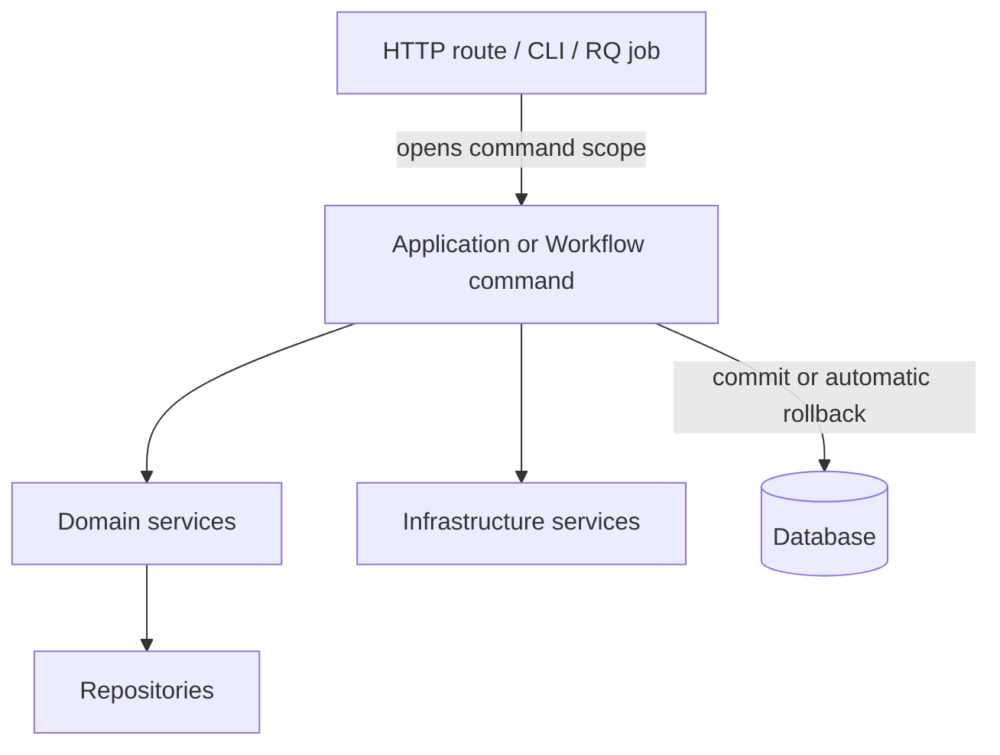

# ADR-002 — Transaction Ownership

- Status: Accepted
- Date: 2026-07-19
- Scope: HTTP commands, CLI commands, background jobs and workflows using SQLAlchemy

## Context

Core currently lets many services commit their own work. Reuse inside Intake is enabled by
`commit=False`, while some nested services (`ReceiptPostingService`, `ImageService`) still
rollback on errors. The outcome is tested and currently correct, but the caller cannot know the
transaction boundary from the service name or type.

Core does not need a generic Unit of Work. It needs one explicit owner per command.

AB-002 implemented this decision for Complete Intake on 2026-07-19. The workflow finalizes the
request-scoped autobegin transaction explicitly because authentication already queries through
the same Session before the route command starts.

## Decision

The outermost Application/Workflow command boundary owns the database transaction.

Rules:

1. One command has exactly one SQL transaction owner.
2. A Workflow/Application command explicitly owns the single final commit/rollback. A
   context-managed `session.begin()` is preferred only when that boundary creates/encloses the
   Session before any query.
3. Domain services and repositories never commit or rollback a caller-owned transaction.
4. Domain services may `flush` only when the current command needs a generated identifier,
   constraint check or SQL-visible row before continuing.
5. Read services never finalize transactions.
6. Simple CRUD without a dedicated application service may use the route/CLI command handler as
   owner. Do not create wrapper classes solely for symmetry.
7. Infrastructure compensates only side effects it owns. For example, LocalImageStorage may
   remove a just-written file; it must not rollback the SQL Session.
8. External remote workflows may use multiple short local transactions as checkpoints. Each
   checkpoint has one owner and is documented by the workflow.

## `commit=False` options considered

### Option A — retain boolean transaction modes

Pros:

- minimal code change;
- preserves current public method signatures;
- current integration tests already exercise important combinations.

Cons:

- every caller must remember a non-domain flag;
- the same service is sometimes owner and sometimes participant;
- nested rollback remains unsafe;
- the pattern spreads with every workflow.

Decision: acceptable only during migration, not the target.

### Option B — explicit boundary-owned transaction

Pros:

- ownership is visible at the command boundary;
- one outer boundary provides one commit/rollback;
- services compose without transaction flags;
- no new abstraction or framework is introduced.

Cons:

- existing write methods and tests require incremental migration;
- the current authentication dependency starts Session autobegin before route execution, so the
  exact scope must be selected deliberately rather than inserting `session.begin()` mechanically.

Decision: **selected**.

### FastAPI autobegin constraint

`get_current_user` and route services receive the same cached `get_session` dependency. The user
lookup starts a transaction before the command method runs. Calling `session.begin()` inside that
method can therefore raise “a transaction is already begun”. AB-002 must choose and test one of:

- the outer command explicitly commits/rolls back the existing request-scoped autobegin
  transaction; or
- a transaction-scoped dependency is introduced so it encloses authentication and command work.

The second option must also preserve file compensation on commit failure. No global dependency
change should be made without testing AQSI enqueue checkpoints and read-only endpoints.

### Option C — lightweight transaction runner/decorator

Pros:

- reduces repeated `session.begin()` boilerplate;
- could centralize transaction logging and metrics.

Cons:

- ownership can become hidden behind decorators;
- encourages framework-building before repetition is proven;
- can evolve into a ceremonial Unit of Work.

Decision: not now. Re-evaluate only after explicit boundaries are implemented and repeated
boilerplate is measured.

## External-side-effect exception: AQSI

AQSI publication is not one atomic transaction. The intended checkpoints are:

1. persist pending attempt and commit;
2. enqueue RQ job; on enqueue failure, persist failure in a new transaction;
3. worker locks attempt, marks processing and commits;
4. perform remote calls;
5. persist accepted/published/failed checkpoint in a new short transaction.

This is deliberate workflow state, not a double-commit defect. Network calls must not occur while
holding long-lived row locks or an uncommitted transaction.

## Migration plan

1. Protect current behavior with transaction and rollback integration tests.
2. Select the FastAPI transaction scope compatible with authentication and media compensation.
3. Migrate `CompleteIntakeWorkflow` and its nested Catalog/Media/Receipt/Posting calls first.
4. Remove nested SQL rollback from Posting and Image metadata operations.
5. Migrate the legacy Intake workflow or retire it.
6. Migrate remaining `commit=False` methods by context when they are next changed.
7. Only then remove boolean parameters.

## Implementation record

- `CompleteIntakeWorkflow` is the sole commit/rollback owner for Complete Intake.
- Catalog, Media-link and Receipt services expose explicit staged operations for that workflow.
- `ReceiptPostingService.apply_posting` participates without commit/rollback, while
  `post_receipt` remains the owner for the direct Receipt command.
- nested Media upload compensates its saved file but does not rollback caller-owned SQL.
- the legacy one-shot Intake workflow and remaining conditional CRUD APIs are intentionally
  deferred to AB-003/AB-005.

## Consequences

- Workflow code becomes the visible consistency boundary.
- Domain service APIs contain business inputs, not transaction-mode switches.
- Rollback tests become simpler and more trustworthy.
- Migration is incremental; mixed old/new transaction style is allowed temporarily only when a
  test proves the boundary.
