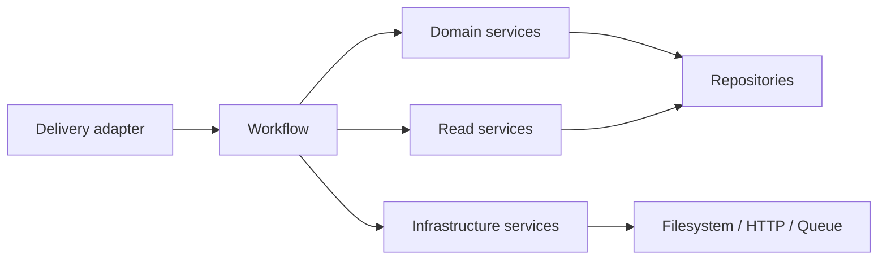

# ADR-003 — Explicit Workflow Layer Without an Engine

- Status: Accepted
- Date: 2026-07-19
- Scope: Cross-aggregate business commands

## Context

Core already has workflows, although several are named as ordinary services. Intake coordinates
Catalog, Media, Receipt, Inventory and Readiness. Receipt posting/cancellation coordinate a
document lifecycle with ledger changes. AQSI coordinates local attempt state with remote effects.

Treating these as Domain Services hides transaction ownership. Introducing BPMN, a generic
Workflow Engine, CQRS or an Event Bus would be disproportionate.

## Decision

Use a small, explicit Application/Workflow layer made of use-case-specific classes. A workflow:

- represents one user/job outcome;
- may coordinate multiple aggregates or bounded contexts;
- owns the command transaction according to ADR-002;
- calls domain/read/infrastructure services;
- returns a response DTO or stable identifiers;
- does not inherit from a workflow base class;
- does not store generic steps or execute a generic state machine.

## Current-to-target map

| Current component | Effective role now | Target name when touched | Action |
| --- | --- | --- | --- |
| `CompleteIntakeWorkflow` | Cross-context workflow | Implemented | Keep cohesive; it owns the Complete Intake transaction |
| `IntakeDraftService` | Workflow commands + read projection | `IntakeDraftWorkflow` plus `IntakeDraftReadService` | Separate by responsibility, not by method count |
| `IntakeService` | Legacy one-shot workflow | None | Deprecate after new Intake UI/API replacement is confirmed |
| `ReceiptPostingService` | Receipt + Inventory workflow | `PostReceiptWorkflow` | Move transaction ownership here when directly invoked; participate under Intake through one boundary design |
| `ReceiptCancellationService` | Receipt + reversal workflow | `CancelReceiptWorkflow` | Naming change may wait; behavior is already cohesive |
| `AqsiPublicationService.request_publication` | Local publication request workflow | `RequestAqsiPublicationWorkflow` | Separate reads only if service continues growing |
| `AqsiPublicationProcessor` | Remote background workflow | `ProcessAqsiPublicationWorkflow` | Document checkpoint transactions; keep gateway injectable |
| `VariantLabelService` | Application query producing an artifact | Keep current name | Not a stateful workflow; rename provides no value |

## Dependency rule

- Domain contexts do not import Intake, Labels, AQSI or workflow classes.
- Readiness may read across authoritative contexts but cannot be imported back by them.
- Workflows may depend on multiple contexts and are the approved location for that fan-out.
- A workflow should prefer another context’s public domain/read service over its repository when
  a suitable operation exists. Do not create ports/interfaces speculatively.

## What is deliberately not introduced

- no generic workflow engine;
- no workflow base class;
- no Event Bus for in-process method calls;
- no CQRS split of storage models;
- no global Unit of Work abstraction;
- no microservice boundaries.

## Consequences

- Cross-context orchestration and transaction ownership become easy to find.
- Domain services stay reusable without boolean transaction flags.
- Class names communicate business outcomes rather than generic “Service” semantics.
- Some existing names remain until the related code is changed; this ADR does not justify a
  rename-only sprint.
